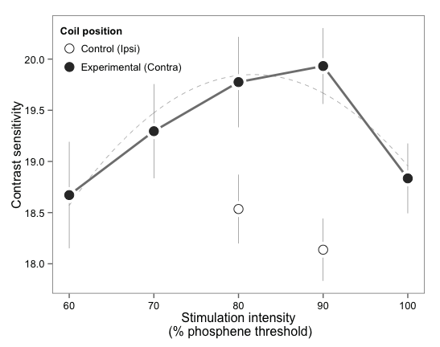
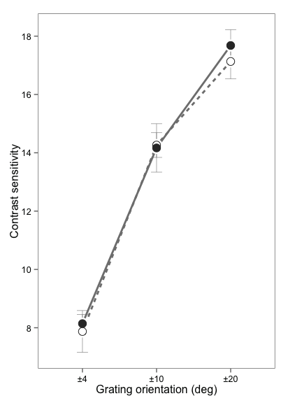

# Table of contents
  
  

### Description
Reproducing data analysis and figures reported in "Low intensity TMS enhances perception of visual stimuli" by Arman Abrahamyan, Colin Clifford, Ehsan Arabzadeh and Justin Harris. You can download all these files, load the project into RStudio and reproduce the analysis by running Data\_analysis\_and_figures.Rmd file. 


Data are provided in RData (Exp1\_Exp2\_github.RData) and Excel (Exp1_Exp2_github.xslx) formats. 


```r
library(plyr)
library(ggplot2)
library(ggthemes)
library(gridExtra)
library(effsize) # for cohen.d
library(pastecs) # For stat.desc
library(afex)
library(nlme) # For linear mixed-effects modelling, lme
library(BayesFactor) # Bayes factor analaysis of different experimental designs
## Load Winston Chan's functions to compute within-subjects error bars
source('WithinSbj_StdErrors.R')
# Load Exp 1 and 2 data 
load("Exp1_Exp2_github.RData")
# Order Conditions for plotting convenience
exp1_dataMean$Condition <- factor(exp1_dataMean$Condition, 
                                  levels=c("NoTMS", "ip80", "ip90", "60", "70", "80", "90", "100"))
```

### Data
Individual subject data for both Exp 1 and 2 are saved as exp1\_dataMean and exp2\_dataMean, respectively. These are data frames. 


```r
head(exp1_dataMean, 4)
```

```
##   PPT Condition     Th Sensitivity
## 1 S01       100 0.1461       7.957
## 2 S01        60 0.1688       6.004
## 3 S01        70 0.0931      11.156
## 4 S01        80 0.1238       8.292
```

```r
head(exp2_dataMean, 4)
```

```
##   PPT Orientation Condition      Th Sensitivity
## 1 S01       10deg    Contra 0.13196       7.801
## 2 S01       10deg      Ipsi 0.12820       8.029
## 3 S01       10deg     NoTMS 0.17725       5.915
## 4 S01       20deg    Contra 0.07478      13.932
```


### Data analysis of Exp 1 (coarse discrimination)
#### Quadratic trend in data 
Here we test if visual sensitivity changes as a function of TMS stimulation intensity when subjects discriminated gratings oriented ±45 deg. Due to repeated-measures design, we conducted mixed-modelling analysis wherein subject was a random effect and TMS stimulation intensity was fixed effect. We fitted linear, cubic and quadratic models to the data and found that quadratic fit explains data better than linear or cubic fits ($\chi^2$(1)=5.22, *p*=0.022).


```r
################## --- Data analysis of Experiment 1 --- ###################
# Order Conditions for plotting convenience
exp1_dataMean$Condition <- factor(exp1_dataMean$Condition, 
                                  levels=c("NoTMS", "ip80", "ip90", "60", "70", "80", "90", "100"))
# Find out if there is a quadratic trend in the data as a function of TMS intensity
# Select only experimental conditions (exclude NoTMS and ipsilatoral stimulation)
exp1_quadraticFitData <- droplevels(subset(exp1_dataMean, !(Condition %in% c("ip80", "ip90", "NoTMS"))))
exp1_quadraticFitData <- within(exp1_quadraticFitData, {CondAsNum <- as.numeric(as.character(Condition)) })
baseline <- lme(data=exp1_quadraticFitData, Sensitivity~1, random=~1|PPT/CondAsNum, method="ML")
linear <- update(baseline, .~. + CondAsNum)
quadratic <- update(baseline, .~. + CondAsNum + I(CondAsNum^2))
cubic <- update(baseline, .~. + CondAsNum + I(CondAsNum^2)+ I(CondAsNum^3))
```


```r
anova(baseline, linear, quadratic, cubic)
```

```
##           Model df   AIC   BIC logLik   Test L.Ratio p-value
## baseline      1  4 248.6 256.6 -120.3                       
## linear        2  5 250.1 260.2 -120.1 1 vs 2   0.448  0.5035
## quadratic     3  6 246.9 258.9 -117.5 2 vs 3   5.216  0.0224
## cubic         4  7 248.2 262.3 -117.1 3 vs 4   0.679  0.4101
```

#### Sensitivity change as a function of TMS stimulation (Figure 1A) 
This corresponds to Figure 1A in the manuscript. The dashed line shows quadratic trend in the data. 


```r
# Compute high-res quadratic trend for the plot
fitX <- data.frame(CondAsNum=seq(60,100, 0.1))
predVals <- data.frame(x=fitX$CondAsNum, y=predict(quadratic, fitX, level=0))
# Plot sensitivity from Exp 1 together with quadratic trend
# Summarise data for plotting
exp1_dataForPlot <- droplevels(subset(exp1_dataMean, Condition!="NoTMS"))
exp1_dataForPlot$CoilPosition <- "Expt"
exp1_dataForPlot$CoilPosition[exp1_dataForPlot$Condition %in% c("ip80", "ip90")] <- "Cntr"
exp1_dataForPlot$CoilPosition <- as.factor(exp1_dataForPlot$CoilPosition)
## Change the name of the column called "Condition" into "Intensity" cause it is more intuitive
colnames(exp1_dataForPlot)[which(names(exp1_dataForPlot) == "Condition")] <- "Intensity"
## Now change ip80 and ip90 into 80 and 90
exp1_dataForPlot$Intensity <- mapvalues(exp1_dataForPlot$Intensity, 
                                        from = c("ip80", "ip90"), to = c("80", "90"))
## Change order of columns (not sure if this is needed, but looks clearer)
exp1_dataForPlot <- droplevels(exp1_dataForPlot[,c("PPT", "CoilPosition", "Intensity", "Th", "Sensitivity")])
# Compute means and within-subjects std errors
exp1_qFitForPlot <- summarySEwithin(exp1_dataForPlot, 
                                    measurevar="Sensitivity", 
                                    withinvars=c("Intensity", "CoilPosition"), 
                                    idvar="PPT")
gExp1_SensTrend <- ggplot(exp1_qFitForPlot, aes(x=as.numeric(as.character(Intensity)), 
                                                y=Sensitivity, color=CoilPosition)) + 
  theme_few() + 
  theme(legend.position=c(0.19,0.87)) + 
  xlab("Stimulation intensity\n (% phosphene threshold)") + 
  ylab("Contrast sensitivity") + 
  geom_line(data=predVals, aes(x=x, y=y), linetype="dashed", colour="grey70", size=.3) +
  geom_line(subset=.(CoilPosition=="Expt"), aes(group=1), color="grey50", size=1) + 
  geom_errorbar(aes(ymin = Sensitivity - se, ymax = Sensitivity + se), 
                width = 0.00, 
                size = 0.2, 
                color="grey50") +   # Change "se" to "ci" to plot 95% conf intervals
  geom_point(size=7, color="white") +
  geom_point(aes(shape=CoilPosition), size=4, color="grey20") + 
  scale_shape_manual(values=c(1,19), name="Coil position", labels=c("Control (Ipsi)","Experimental (Contra)"))
print(gExp1_SensTrend)
```

 

#### Enhancement in visual sensitivity
To confirm enhancement in visual sensitivity, here we compare experimental (contralateral) stimulation with control (ipsilateral) stimulation. Because ipsilateral control condition was only tested at two TMS intensities (80 and 90% of PT), we performed a 2x2 repeated measures ANOVA comparing the location of the TMS coil (experimental vs control) and stimulation intensities (80 and 90%). 


```r
# Compute 2x2 ANOVA comparing 80% and 90% ipsi and contra conditions
exp1_data8090 <- droplevels(subset(exp1_dataForPlot,  Intensity %in% c("80", "90")))
aov8090 <- aov.car(data=exp1_data8090, Sensitivity~CoilPosition*Intensity+Error(PPT/(CoilPosition*Intensity)), return="Anova", args.return=list(es="pes"))
nice.anova(aov8090, es="pes")
```

```
##                   Effect    df  MSE         F  pes     p
## 1           CoilPosition 1, 10 0.76 33.45 ***  .77 .0002
## 2              Intensity 1, 10 1.67      0.10 .009   .76
## 3 CoilPosition:Intensity 1, 10 1.67      0.50  .05   .49
```

This analysis confirmed that there was a significant main effect for the location of the TMS coil (*F*(1,10)=33.45, *p*<0.001, partial $\eta^2$=0.77). However, the main effect of stimulation intensity was not significant, indicating no difference between 80 and 90% intensities (*F*(1,10)=0.10, *p*=0.76, partial $\eta^2$=0.009). Further, there was no interaction between TMS location and stimulation intensity (*F*(1,10)=0.50, *p*=0.49, partial $\eta^2$=0.05).

We followed up with paired t-tests, which showed significant differences between experimental and control conditions at both 80% and 90% stimulation (80%: *Mdiff* =1.24, *t*(10)=2.65, *p*=0.02, Cohen’s *d*=0.27; 90%: *Mdiff* =1.80, *t*(10)=3.80, *p*=0.003, Cohen’s *d*=0.47).

**80% contra vs ipsi**

```r
# t-tests
# Compare 80% experimental and control conditions for sensitivity
exp1_data80 <- droplevels(subset(exp1_data8090, Intensity=="80"))
exp1_ttest80 <- t.test(Sensitivity~CoilPosition, data=exp1_data80, paired=TRUE)
# Compute effect size r using formula from DSUR (sqrt(t^2/(t^2+df)))
paste('r =', sqrt(exp1_ttest80$statistic[[1]]^2/(exp1_ttest80$statistic[[1]]^2+exp1_ttest80$parameter[[1]])))
```

```
## [1] "r = 0.641549923796786"
```

```r
# Cohen's d is another estimate of effect size. 
cohen.d(data=exp1_data80, Sensitivity~CoilPosition)
```

```
## 
## Cohen's d
## 
## d estimate: -0.2689 (small)
## 95 percent confidence interval:
##     inf     sup 
## -1.2064  0.6686
```

**90% contra vs ipsi**

```r
# 90% experimental vs control 
exp1_data90 <- droplevels(subset(exp1_data8090, Intensity=="90"))
exp1_ttest90 <- t.test(Sensitivity~CoilPosition, data=exp1_data90, paired=TRUE)
print(exp1_ttest90)
```

```
## 
## 	Paired t-test
## 
## data:  Sensitivity by CoilPosition
## t = -3.808, df = 10, p-value = 0.003438
## alternative hypothesis: true difference in means is not equal to 0
## 95 percent confidence interval:
##  -2.8447 -0.7447
## sample estimates:
## mean of the differences 
##                  -1.795
```

```r
paste('r =', sqrt(exp1_ttest90$statistic[[1]]^2/(exp1_ttest90$statistic[[1]]^2+exp1_ttest90$parameter[[1]])))
```

```
## [1] "r = 0.769350361865236"
```

```r
cohen.d(data=exp1_data90, Sensitivity~CoilPosition)
```

```
## 
## Cohen's d
## 
## d estimate: -0.4727 (small)
## 95 percent confidence interval:
##     inf     sup 
## -1.4198  0.4744
```

**Control (ipsi) vs no-TMS**

```r
## Compare ipsi and no-TMS for
exp1_ipsiNoTMS <- droplevels(subset(exp1_dataMean, Condition %in% c("ip80", "ip90", "NoTMS")))
exp1_ipsiNoTMSSens <- cast(exp1_ipsiNoTMS, PPT~Condition, value=.(Sensitivity))
exp1_ipsiNoTMSSens <- ddply(exp1_ipsiNoTMSSens, .(PPT, NoTMS, ip80, ip90), mutate, ipMean=(ip80+ip90)/2)
exp1_ttestNoTMS <- t.test(exp1_ipsiNoTMSSens$NoTMS, exp1_ipsiNoTMSSens$ipMean, paired=TRUE)
print(exp1_ttestNoTMS)
```

```
## 
## 	Paired t-test
## 
## data:  exp1_ipsiNoTMSSens$NoTMS and exp1_ipsiNoTMSSens$ipMean
## t = 2.624, df = 10, p-value = 0.0254
## alternative hypothesis: true difference in means is not equal to 0
## 95 percent confidence interval:
##  0.1651 2.0208
## sample estimates:
## mean of the differences 
##                   1.093
```

```r
# Compute effect size r
paste('r =', sqrt(exp1_ttestNoTMS$statistic[[1]]^2/(exp1_ttestNoTMS$statistic[[1]]^2+exp1_ttestNoTMS$parameter[[1]])))
```

```
## [1] "r = 0.638638128620297"
```

```r
# Cohen's d
cohen.d(exp1_ipsiNoTMSSens$NoTMS, exp1_ipsiNoTMSSens$ipMean)
```

```
## 
## Cohen's d
## 
## d estimate: 0.2625 (small)
## 95 percent confidence interval:
##     inf     sup 
## -0.6748  1.1998
```

### Data analysis of Exp 2 (fine discrimination)

#### Plot fine orientation discrimination 

As can be seen from the plot, dubjects did not show enhancement in visual sensitivity during fine discrimination of grating oriented ±4, ±10 or ±20 deg. 


```r
# exclude NoTMS
exp2_dataMeansTMS <- droplevels(subset(exp2_dataMean, Condition!="NoTMS"))
# Column name to be compatible with column names in Exp 1
colnames(exp2_dataMeansTMS)[which(names(exp2_dataMeansTMS) == "Condition")] <- "CoilPosition"

################## --- Data analysis of combined Experiment 2 --- ###################
# Function to plot Experiment 2 data. Can also plot combined Exp 2 and Exp 1 data 
Exp2_PlotByOrientations <- function(dat, 
                                    whatToPlot='Sensitivity',    # Variable on y axis
                                    breaks)                      # y-axis breaks. If not specified, ggplot default is used
{
  datSummary <- summarySEwithin(dat, measurevar=whatToPlot, 
                                withinvars=c("Orientation", "CoilPosition"), 
                                idvar="PPT")
  # Sort Orientations in ascending order
  datSummary$Orientation <- factor(datSummary$Orientation, 
                                   levels = c("4deg", "10deg", "20deg", "45deg@80", "45deg@90"))
  dodgePos=position_dodge(width=0.0)
  g <- ggplot(data=datSummary, aes_string(x='Orientation', y=whatToPlot)) + 
    theme_few() + 
    geom_errorbar(aes_string(ymin = paste(whatToPlot, '- se'), 
                             ymax = paste(whatToPlot, '+ se'), 
                             group='CoilPosition'), 
                  width = 0.15, 
                  size = 0.2, 
                  color="grey50") +   # Change "se" to "ci" to plot 95% conf intervals
    geom_line(aes(group=CoilPosition, linetype=CoilPosition), color="grey50", size=1) + 
    geom_point(size=6.1, color="white") +
    geom_point(aes(shape=CoilPosition), size=4, color="grey20") + 
    scale_x_discrete(labels=c("±4", "±10", "±20", "±45\n(80% TMS)", "±45\n(90% TMS)")) + 
    theme(legend.position="none") +
    xlab("Grating orientation (deg)") + ylab("Contrast sensitivity") +
    scale_shape_manual(values=c(19,1), name="Coil\nposition")
  if (!missing(breaks)) {
    g <- g + scale_y_continuous(breaks = breaks)
  }
  return(g)
}
# Plot fine orientation discrimination sensitivity for contra and ipsi 
exp2_plot <- Exp2_PlotByOrientations(exp2_dataMeansTMS, whatToPlot='Sensitivity', breaks=seq(8, 18, 2))
print(exp2_plot)
```

 

#### Statistics

A 2x3 repeated measures ANOVA using TMS stimulation sites (contralateral vs ipsilateral) and orientations (4º, 10º, 20º) as factors showed a significant main effect of orientation (*F*(1.99, 15.95)=123.86, *p*<0.01, partial $\eta^2$=0.94, Greenhouse–Geisser corrected). However, there was no significant main effect of TMS stimulation site (*F*(1, 8)=0.13, *p*=0.73, partial $\eta^2$=0.02), nor was there an interaction between stimulation site and grating orientation (*F*(1.63, 13.04)=0.28, *p*=0.72, partial $\eta^2$=0.03, Greenhouse–Geisser corrected). 


```r
# Compute 2x3 repeated-measures ANOVA comparing coil position (ipsi, contra) and orientations (4,10,20)
exp2_aov2by3Sens <- aov.car(data=exp2_dataMeansTMS, Sensitivity~CoilPosition*Orientation+Error(PPT/(CoilPosition*Orientation)), return="Anova", args.return=list(es="pes"))
nice.anova(exp2_aov2by3Sens, es="pes")
```

```
##                     Effect          df  MSE          F pes      p
## 1             CoilPosition        1, 8 5.94       0.13 .02    .73
## 2              Orientation 1.99, 15.95 3.33 123.86 *** .94 <.0001
## 3 CoilPosition:Orientation 1.63, 13.04 2.10       0.28 .03    .72
```

To assess the strength of the evidence for the null hypothesis that there is no difference between experimental and control TMS stimulation sites, we ran a Bayes factor analysis for paired t-tests with the r scale parameter set to 1.0 to provide equal support for the null and alternative hypotheses (Rouder et al., 2009). 


```r
# Bayes factor two-samples t-test against the NULL hypothesis that the difference between samples is 0
exp2_meanContraIpsi <- cast(exp2_dataMeansTMS, PPT~CoilPosition, value=.(Sensitivity), mean)
# rscale in Bayes factor provides support for the null hypothesis. We will set it 1.0 to 
# provide equal support for the null and alternative hypotheses (Rouder et al., 2009)
exp2_contraIpsiBF <- ttestBF(x=exp2_meanContraIpsi$Contra, y=exp2_meanContraIpsi$Ipsi, paired = TRUE, rscale=1.0)
# Get likelihood of NULL hypothesis over difference between contra and ipsi
1/exp2_contraIpsiBF
```

```
## Bayes factor analysis
## --------------
## [1] Null, mu=0 : 3.868 ±0%
## 
## Against denominator:
##   Alternative, r = 1, mu =/= 0 
## ---
## Bayes factor type: BFoneSample, JZS
```

The Bayes factor analysis shows that it is 3.9 times more likely that there is no effect of TMS during fine orientation discrimination than there is some effect, which is within the range of substantial evidence (Jeffreys, 1961).


    
    
    
